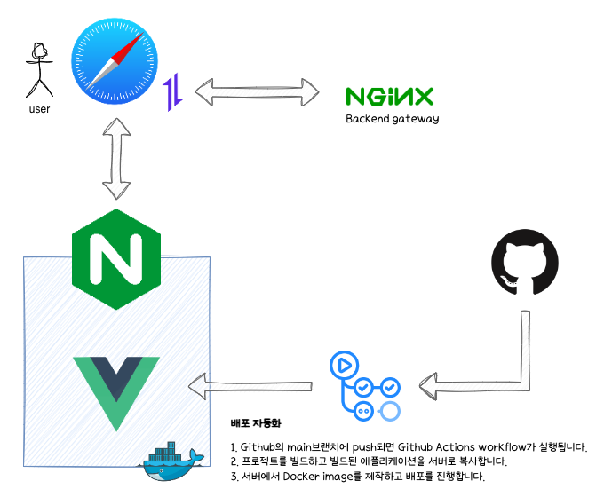

# see-space-frontend
see-space프론트엔드입니다.<br>
axios를 통해 msa로 구성된 backend와 nginx gateway를 통해 통신합니다.<br>


## project - architecture


## TechStack
Framework: Vue3.js<br>
UI-component: vuetify3<br>

libray: axios, pinia, vuerouter

## 전체 프로젝트 아키텍쳐 구상도 (미완)


## Project setup
```
npm install
```

### Compiles and hot-reloads for development
```
npm run serve
```

### Compiles and minifies for production
```
npm run build
```

### Lints and fixes files
```
npm run lint
```

### Customize configuration
See [Configuration Reference](https://cli.vuejs.org/config/).
