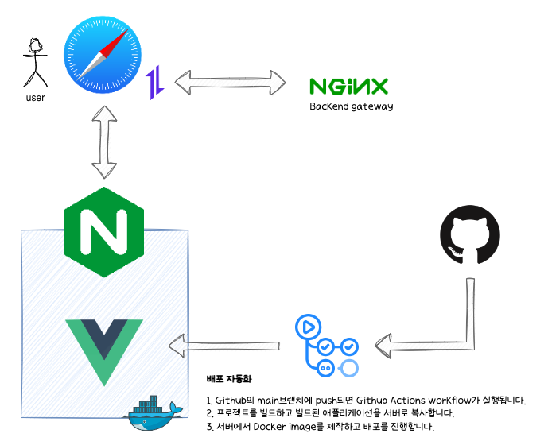
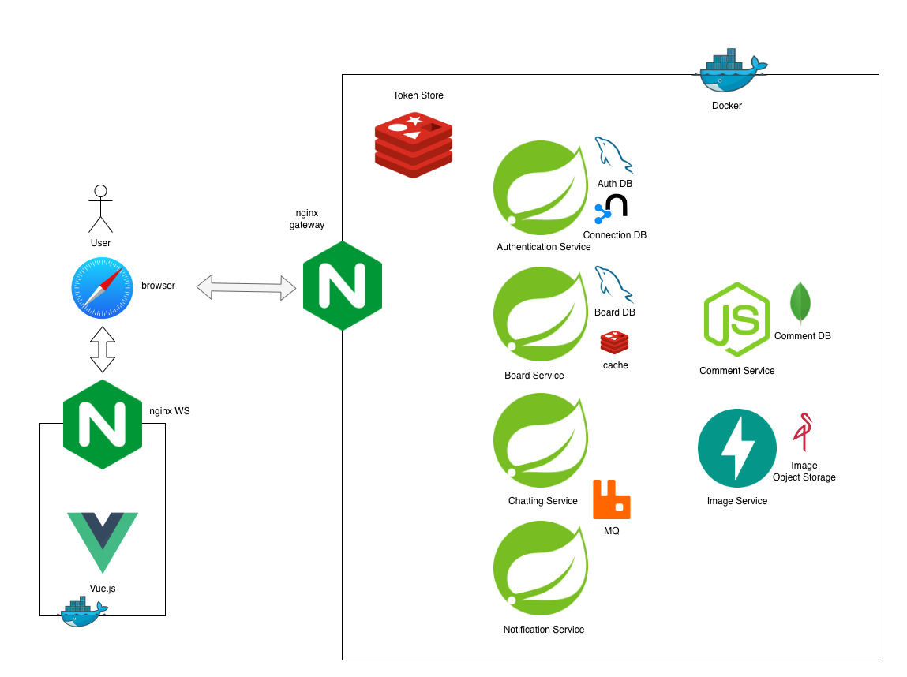

# see-space-frontend
see-space프론트엔드입니다. 
axios를 통해 msa로 구성된 backend와 nginx gateway를 통해 통신합니다. 
[배포 페이지](http://iknowca.xyz:9015)

## project - architecture

## TechStack
Framework: Vue3.js 
UI-component: vuetify3 

libray: axios, pinia, vuerouter

## 전체 프로젝트 아키텍쳐 구상도 (미완)

## Full Tech Stack of Project
Framework: SpringBoot / Node.js / FastApi / Vue3.js 
DB: MySQL(JPA, MyBatis) / Redis / MongoDB / Neo4j / minio 
ENV: Docker / Nginx / RabbitMQ 
Language: Java / JavaScript / Python 
CI/CD: GitHub Actions 
UI-component: vuetify3 
Test: Junit5 / Mockito / Testcontainer / Jest  
Documentation: Swagger 

